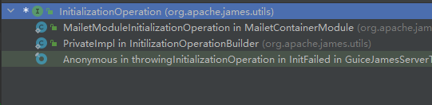
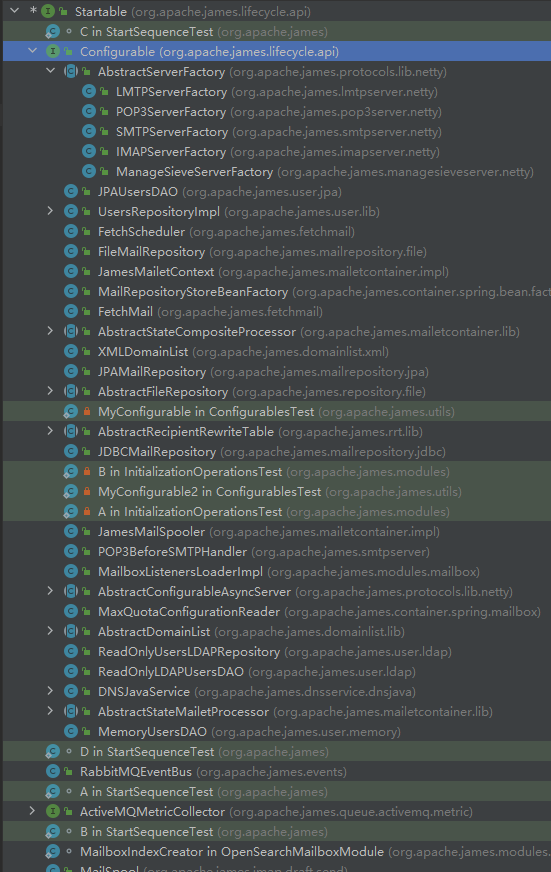
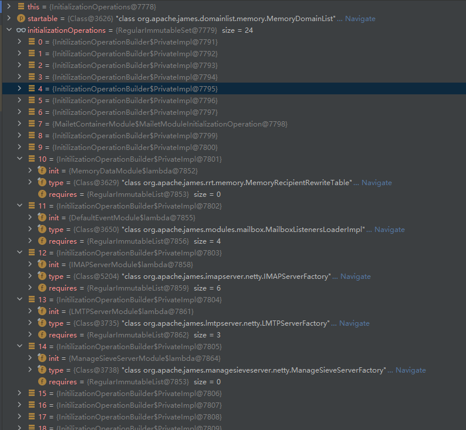
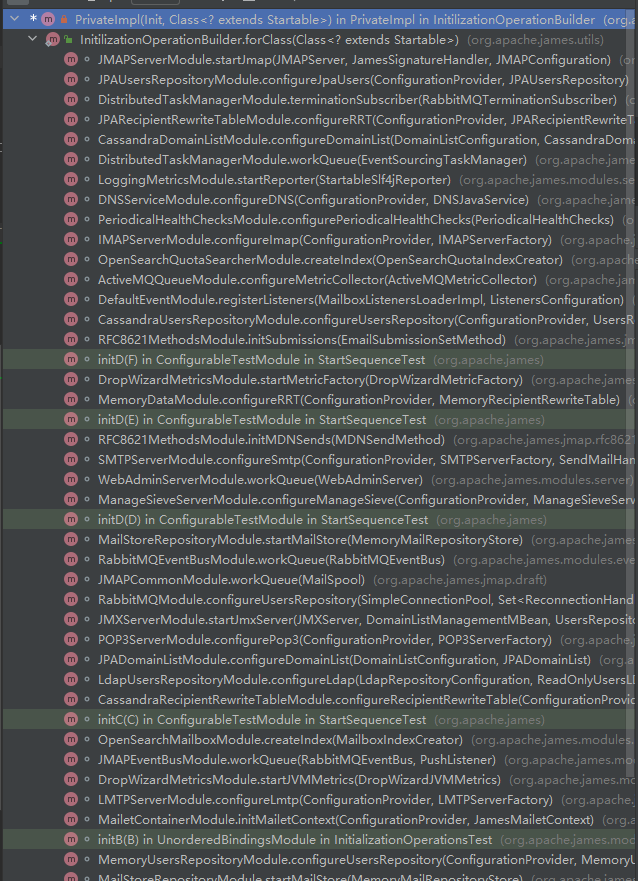

MemoryJamesServerMain is the start class of the memory-app. We take a look at the main function.
```
public static void main(String[] args) throws Exception {
    ExtraProperties.initialize();

    MemoryJamesConfiguration configuration = MemoryJamesConfiguration.builder()
        .useWorkingDirectoryEnvProperty()
        .build();

    LOGGER.info("Loading configuration {}", configuration.toString());
    GuiceJamesServer server = createServer(configuration)
        .combineWith(new FakeSearchMailboxModule(), new JMXServerModule())
        .overrideWith(new RunArgumentsModule(args));

    JamesServerMain.main(server);
}
```

The code block of 'ExtraProperties.initialize();' is to load extra properties. This is a mechanism to customise properties for users.

The next code block is to create an instance of MemoryJamesConfiguration. We're not going to dig it. We can make a deduction that the 
class would scan the conf directory and load the content of all files into memory. Then we can get the configurations easily.

The next code block is to create an instance of GuiceJamesServer. In the initial process of GuiceJamesServer, there invokes
combineWith function many times. Before we get into this, we should learn a little knowledge about Guice. Guice is a lightweight dependency 
injection framework for Java. You can get more details from the official document: https://github.com/google/guice/wiki/. For us, we don't 
have to learn too much about Guice, just need to know three critical classes.
1. AbstractModule. Some classes which extend AbstractModule are where you can create instances managed by the Guice Container. If you are 
familiar with Spring, you could consider the classes which extend AbstractModule is where you define beans.
2. @Inject. In the Guice Container, Some classes maybe depend on other classes. So you can use @Inject decorated in contraction method to get the 
instances of classes needed.
3. @ProvidesIntoSet. In the Guice Container, you can use @ProvidesIntoSet to set a group of classes that implement the same 
interface to a set-type variable. This is a very important feature. Later you will find out, the start mechanism of Apache James 
depends on the feature.

We go back the main function. The next code block is to create an instance of GuiceJamesServer. Just going into the JamesServerMain.main.
```
static void main(GuiceJamesServer server) throws Exception {
    server.start();

    Runtime.getRuntime().addShutdownHook(new Thread(server::stop));
}
```
'Runtime.getRuntime().addShutdownHook(new Thread(server::stop));' is just a hook which is invoked when the server stops. This is not what we care. Keep going 
into 'server.start();'.
```
public void start() throws Exception {
    try {
        Injector injector = Guice.createInjector(module);
        guiceProbeProvider = injector.getInstance(GuiceProbeProvider.class);
        preDestroy = injector.getInstance(Key.get(new TypeLiteral<Stager<PreDestroy>>() {
        }));
        injector.getInstance(ConfigurationSanitizingPerformer.class).sanitize();
        injector.getInstance(StartUpChecksPerformer.class).performCheck();
        injector.getInstance(InitializationOperations.class).initModules();
        isStartedProbe.notifyStarted();
        LOGGER.info("JAMES server started");
    } catch (Throwable e) {
        LOGGER.error("Fatal error while starting James", e);
        if (SHOULD_EXIT_ON_STARTUP_ERROR) {
            System.exit(1);
        } else {
            throw e;
        }
    }
}
```
This looks like the core code of starting. 'injector.getInstance(InitializationOperations.class).initModules();' does all start work.
You can individually debug other lines which just do some check work. Going into InitializationOperations.
```
public class InitializationOperations {

    private final Set<InitializationOperation> initializationOperations;
    private final Startables startables;

    @Inject
    public InitializationOperations(Set<InitializationOperation> initializationOperations, Startables startables) {
        this.initializationOperations = initializationOperations;
        this.startables = startables;
    }

    public void initModules() {
        Set<InitializationOperation> processed = processStartables();
        
        processOthers(processed);
    }

    private Set<InitializationOperation> processStartables() {
        return startables.get().stream()
            .flatMap(this::configurationPerformerFor)
            .distinct()
            .peek(Throwing.consumer(InitializationOperation::initModule).sneakyThrow())
            .collect(Collectors.toSet());
    }

    private Stream<InitializationOperation> configurationPerformerFor(Class<?> startable) {
        return initializationOperations.stream()
                .filter(x -> startable.isAssignableFrom(x.forClass()))
                .flatMap(x -> Stream.concat(x.requires().stream().flatMap(this::configurationPerformerFor), Stream.of(x)));
    }

    private void processOthers(Set<InitializationOperation> processed) {
        initializationOperations.stream()
            .filter(x -> !processed.contains(x))
            .forEach(Throwing.consumer(InitializationOperation::initModule).sneakyThrow());
    }
}
```
There are not too many codes, however it is a little hard to understand.
Do you still remember the function of @ProvidesIntoSet? InitializationOperations has a set-type variable named 
initializationOperations and a Startables-type variable named startables. The Startables has a set-type variable named startables.
So these classes implement Startable interface and these classes implement InitializationOperation interface will be used in there.
Let's take a look at these classes.


We can see many classes implement Startable interface like SMTPServerFactory, IMAPServerFactory. That is what we are looking for.
Going back initModules function. The first code block is to invoke processStartables function. Going into processStartables.
The function applies configurationPerformerFor to every instance of Startable and get a stream consisting of the distinct InitializationOperation elements, 
then invokes the initModule function of all InitializationOperation elements.
In the configurationPerformerFor function, initializationOperations will be filtered by the 'startable.isAssignableFrom(x.forClass())'. We take a look 
at initializationOperations.

There are many instances of InitializationOperation. We find an instance of InitilizationOperationBuilder$PrivateImpl with a IMAPServerFactory-type variable.
The IMAPServerFactory also implements the Startable interface. Maybe this is the connection between Startable and InitializationOperation.
InitializationOperation.forClass is an abstract function which is implemented by InitilizationOperationBuilder.PrivateImpl.
InitilizationOperationBuilder.PrivateImpl.forClass function just returns the type variable which is set in the construction function. Taking a look at how 
many InitilizationOperationBuilder.PrivateImpl are created.

We find something about IMAPServerFactory. Going into it.
```
@ProvidesIntoSet
InitializationOperation configureImap(ConfigurationProvider configurationProvider, IMAPServerFactory imapServerFactory) {
    return InitilizationOperationBuilder
        .forClass(IMAPServerFactory.class)
        .init(() -> {
            imapServerFactory.configure(configurationProvider.getConfiguration("imapserver"));
            imapServerFactory.init();
        });
}
```
The function create an instance of InitilizationOperationBuilder.PrivateImpl, and set IMAPServerFactory class to the type variable, 
and set a code block to init variable. That code block will be executed when the InitializationOperation.initModule is invoked.
Going back InitializationOperations.configurationPerformerFor. After filtering operation, it will recursively invoke configurationPerformerFor function to solve injected instances.
Finally, InitializationOperations.configurationPerformerFor returns a stream of InitializationOperation connected with Startable.
After invoking configurationPerformerFor function, the processStartables will invoke InitializationOperation.initModule function. All 
modules will be created and initialized by this way. Going back initModules function, 'processOthers(processed);' is to handle unprocessed InitializationOperation.

Now, let's take an instance and simplify the process.

Apache James supports SMTP, IMAP, POP3 protocols. Every protocol is binding to a server. Now we want to create a server provides SMTP protocol service.
Firstly we define a SMTPServerFactory class implements the Startable interface.
Secondly we create an instance of InitilizationOperationBuilder.PrivateImpl, and set the type and init variable like this:
```
@ProvidesIntoSet
InitializationOperation configureSmtp(ConfigurationProvider configurationProvider,
                                    SMTPServerFactory smtpServerFactory,
                                    SendMailHandler sendMailHandler) {
    return InitilizationOperationBuilder
        .forClass(SMTPServerFactory.class)
        .init(() -> {
            smtpServerFactory.configure(configurationProvider.getConfiguration("smtpserver"));
            smtpServerFactory.init();
            sendMailHandler.init(null);
        });
}
```
When the main is invoked, the Guice container will create an instance of SMTPServerFactory, then invoke InitializationOperation.initModule function.
The InitializationOperation.initModule function will execute the code block which we set to init variable. For SMTPServerFactory is this:
```
smtpServerFactory.configure(configurationProvider.getConfiguration("smtpserver"));
smtpServerFactory.init();
sendMailHandler.init(null);
```
'smtpServerFactory.init();' will create an instance of SMTPServer and initialize it. When the initialization is done, the SMTPServer 
will be running and provide SMTP protocol service.

Other modules start use the same way.
