You can download the code of Apache James from: https://github.com/apache/james-project. My project is based on the 3.8.1 version, and suggest you to use the same version.

After you import the downloaded codes into the IDEA, maybe the project panel looks like this:
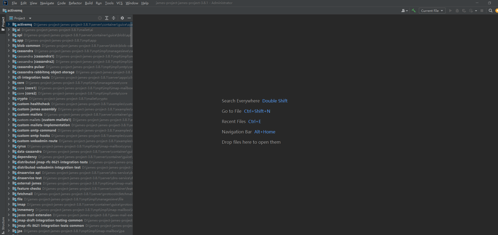

All modules are flatted. Don’t worry, we would solve all the problems step by step until the project is running.

Find the pom.xml in the root directory of the project, right click it and select the `+Add as Maven project`, then left click it.
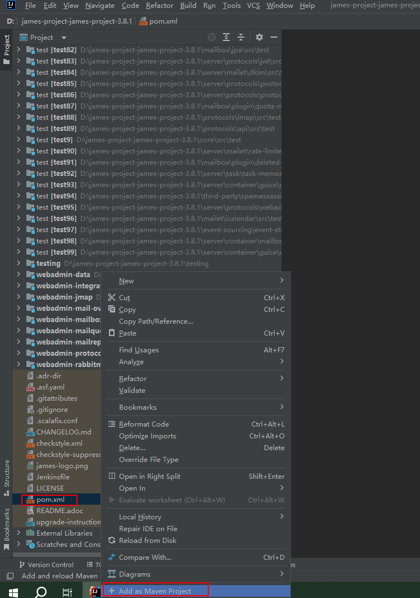

IDEA would re-load the project as a Maven project. After re-loading, the project looks like this:
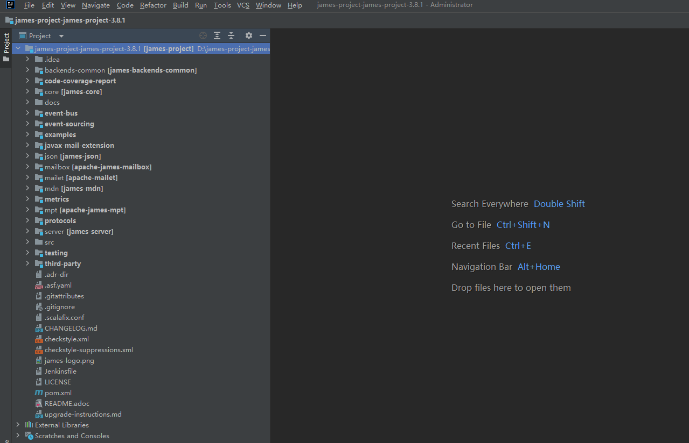

Hovering on any one of these modules and right click it, selecting the `Open Module Settings` and left click it. You would see many modules on the panel. Removing all modules prefixed with main and test, then click OK buttion. Maybe you would encounter a error pop-up box like this:
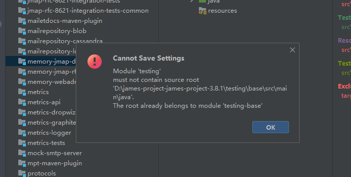

The error message wants to tell us the testing module and testing-base use the same source root. We should remove the testing module because the base is a module located in testing directory. Do it in this way if you encounter other problems like this.

Before we run the project, we should execute the maven command ‘mvn install’. Apache James have many modules which depend each other. We need to compile all modules and install them to local repository, then we can run the project. We use maven 3.6.3 and scala 2.12.14, you can find some information from there: https://james.apache.org/server/dev-build.html. IDEA has a default maven. We can change it in there:
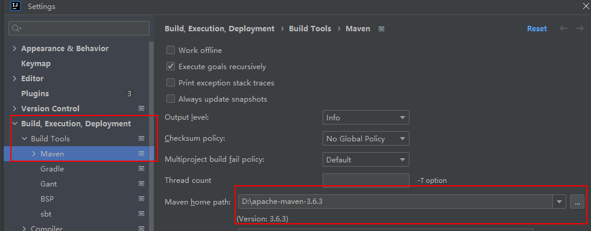

You should download the scala and set relevant environment variables.

After done these above, we should open a terminal windows of IDEA, and input ‘mvn clean install -DskipTests=true’. Maven begins to execute install command. In the process, we may meet some errors. Don’t worry, we would solve all the problems.

Fortunately, the maven task is successful.
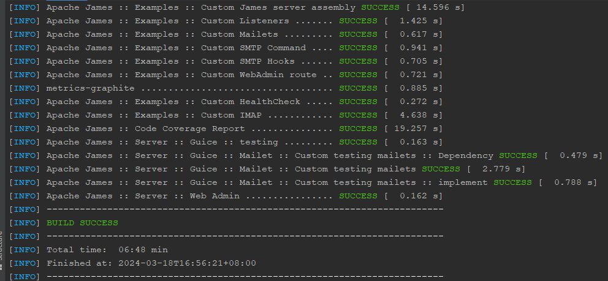

If you meet the ‘dependencies download fail, 502 gate wrong’, trying it again would solve the problem.

These are many start entrances in server/apps. We choose the memory-app because it is easy to understand.

Debugging MemoryJamesServerMain.main() for the first time, you should specify the working.directory VM option. Like this:
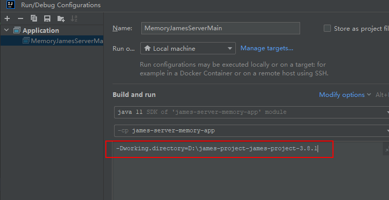

Additionally, you should create a conf directory in the root directory of project and copy all files in the server/apps/memory/app/sample-configuration directory. Now you can debug the project.

Maybe you would meet a problem like this:
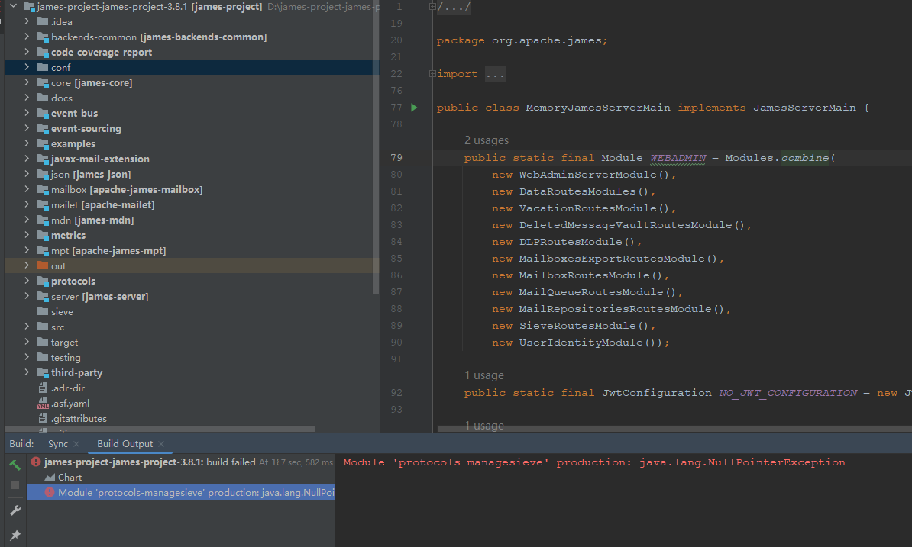

Every time you debug the project, there would generate a out directory. You could not re-debug the project until you delete the out directory. There are two protocols-managesieve modules:
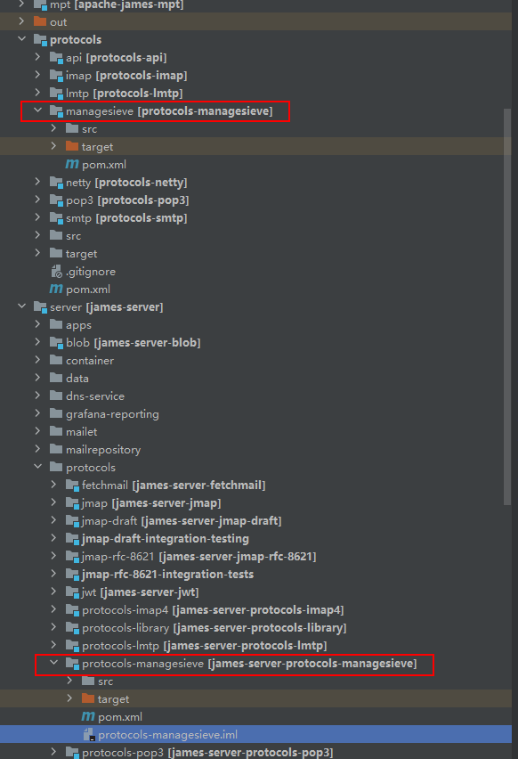

Maybe IDEA is confused with them. You can solve the problem by deleting the protocols-managesieve.iml in server/protocols/protocols-managesieve.

Apache James supports SSL/TLS protocol, which need a keystore file. We can generate the file in conf directory by keytool. First we enter the conf directory, then input these contents below:
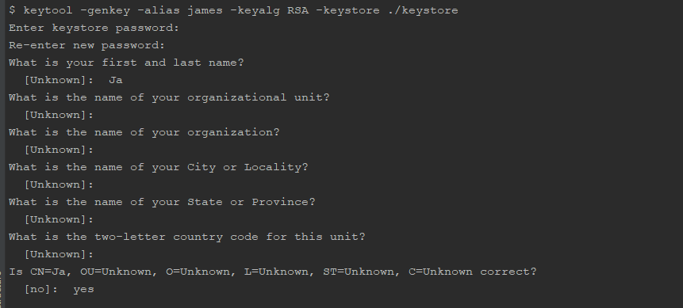

The password is specified by the value of secret in imapserver.xml, pop3server.xml, smtpserver.xml. You should keep the same password in all .xml. To other values, you can input enter directly.

Maybe you would meet the problem like this:
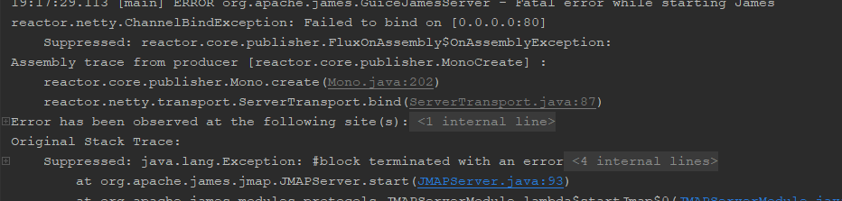

Changing the port to a available port in jmap.properties.

Finally, we debug the project successfully.
